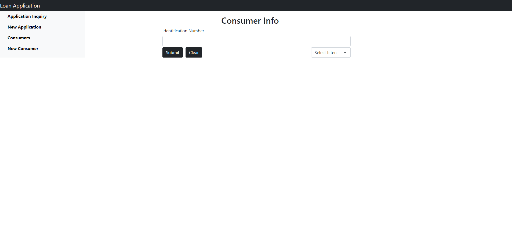
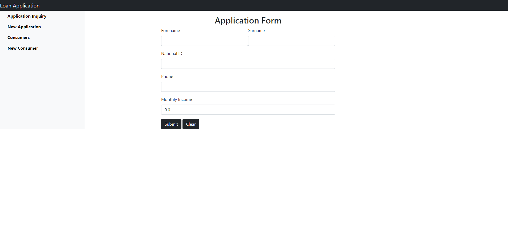
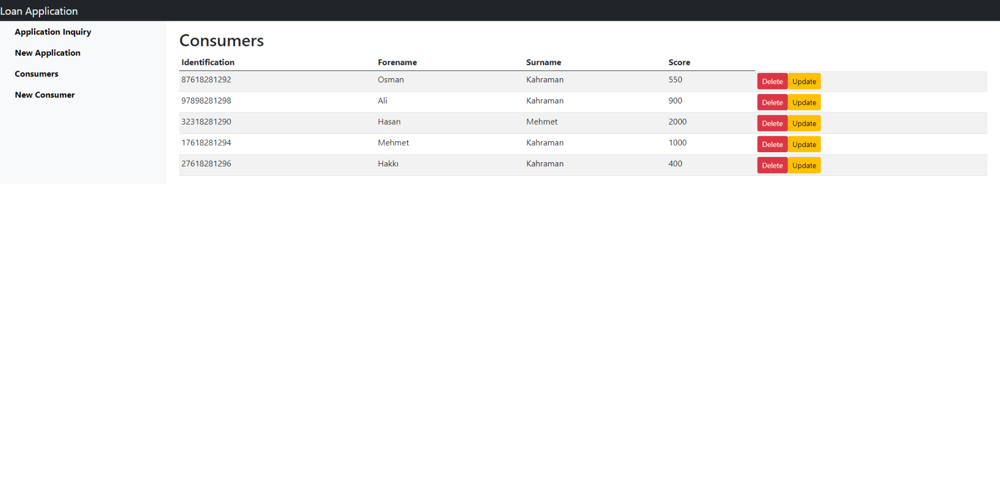
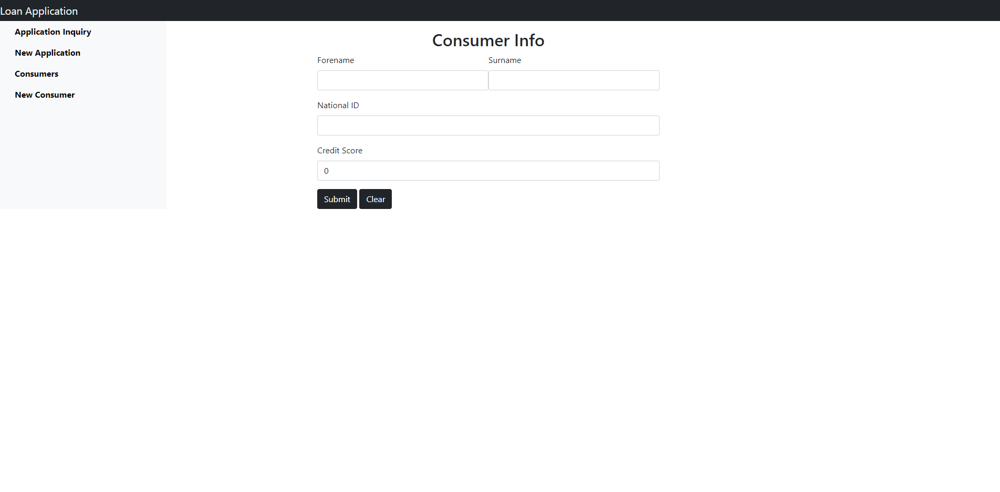
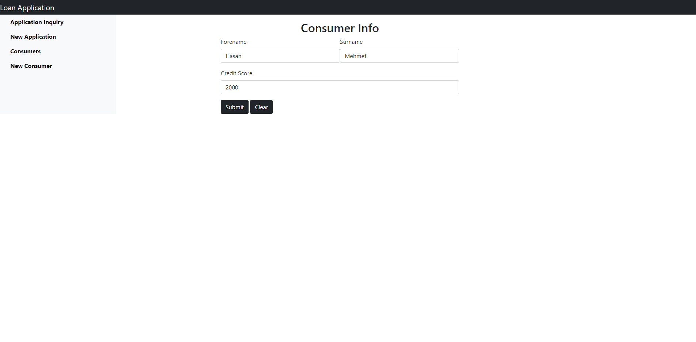
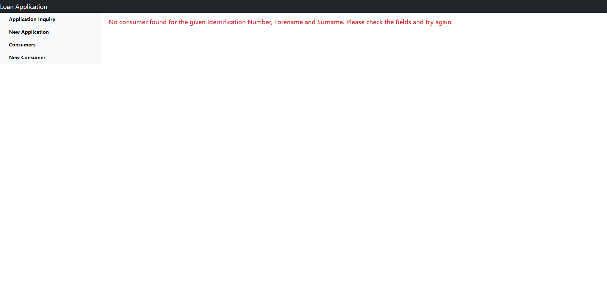
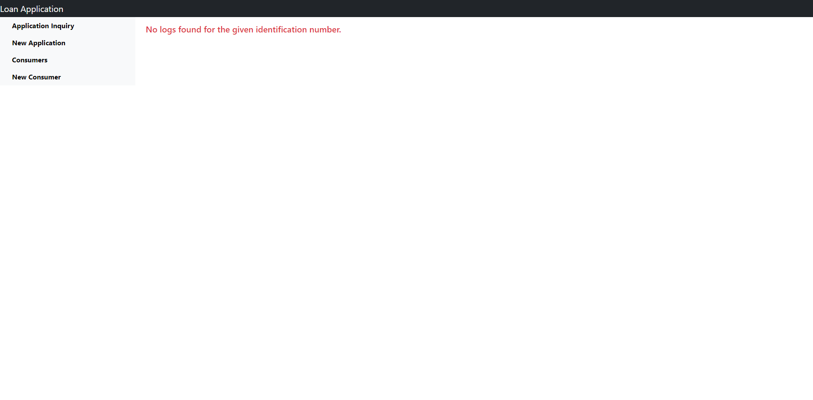
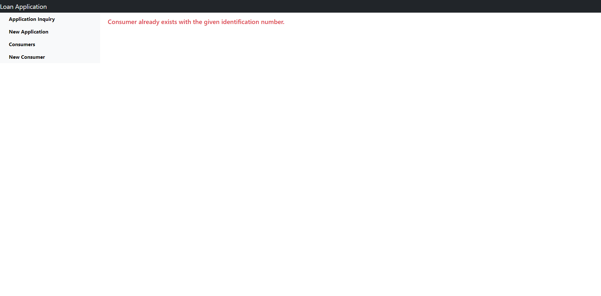

# Loan Inquiry Application
A simple loan inquiry application which is assigned as GittiGidiyor Java-Spring Bootcamp graduation criteria. It is composed of three microservices:  Findex Inquiry Service, Loan Application Service and SMS Service. All the three
microservices communicate with each other through Spring Cloud Gateway and registered to Eureka Service Registry. For the visual representation of operations, I have built
a simple UI with Spring-Thymeleaf.
## Table of Contents
- [Technologies](#technologies)
- [Services](#services)
    - [Loan Application Service](#loan-app-service)
    - [Findex Inquiry Service](#findex-service)
    - [SMS Service](#sms-service)
- [Installing](#installing)
    - [Maven](#maven)
    - [Docker](#docker)
- [Usage](#usage)
    - [Loan Application UI](#loan-application-ui)
- [Versions](#versions)
- [Contributing](#contributing)

## Technologies
- OpenJDK 11
- Maven
- Spring Data JPA
- Spring Cloud Gateway
- Eureka Service Registry
- SpringFox Swagger 2
- Lombok
- JIB
- Thymeleaf
## Services
The main requirement for the project was that the consumer would be able to apply for a loan(optionally through UI) with their forename,
surname, identification number and phone. Then the eligibility for the consumer would be calculated server-side, and the result would be
shown to the consumer and then persisted to database for later queries. Along with that, an SMS notification would be sent to the consumer. It was
not <b>necessary</b> to go with microservice architecture and if we give it a second thought it is not <b>reasonable</b> for such a small
task. But since it was part of the bootcamp process, and I was lacking knowledge on it, I have chosen it over monolithic architecture to push myself even further.
Given that, it consists of three microservice mocks: Findex Inquiry Service, SMS Service, Loan Application Service. They are discovered by Eureka Service Registry and
the incoming requests are routed by Spring Cloud Gateway to the corresponding services. Used RestTemplate to communicate with other services.
### Loan Application Service
The main job of the service is to process the loan application request, send eligibility notices and log the applications 
to the database for later queries. It simply takes consumer info and returns a result message which contains elibility status and credit limit. How it decides eligibility and credit limit? Well, if the credit score of the consumer which is acquired from Findex
Inquiry Service is lower than 500, the consumer is not eligible. If it is higher, and the monthly income of the consumer is less then 5000
then the consumer is eligible for 10000 TRY, else if the monthly income is higher than 5000 the limit raises to 20000 TRY. If the score is higher then
1000, the credit limit is calculated as follows: limit = income*4. Credit score is acquired from Findex Inquiry Service. Always sends the result to the SMS Service
to notify consumer on phone.

**Endpoints**

| Endpoint | Method |  Params | Description                                                                                                                                                           |
| -------------:|:--------:|:-------:| --------------------------------------------------------------------------------------------------------------------------------------------------------------------- |
|    `/api/loan-applications` | GET | id, filter  | Get the application list by the given ID number. Support three types of `filter`    : ``ASC``, `DESC`, ``LAST``. It is set to ``UNFILTERED`` by default.                                                               |
|    `/api/loan-applications` | POST | none  |       Post a new application. Request a body which contains `forename`, `surname`, `identificationNumber`, `monthlyIncome` and the `phone` of the consumer. 
|   `/swagger-ui.html` | GET | none | Swagger documentation page.

### Findex Inquiry Service
This is a service which <b>fictionally</b> holds all the financial history of the consumer along with his/her credit score. 
In our situation, it just calculates the credit score according to a simple algorithm and returns it if queried. The credit score is calculated
according to the last number of the identification number:
- 0 -> 2000
- 2 -> 550
- 4 -> 1000
- 6 -> 400
- 8 -> 900

Since it holds consumer related data, it has a Consumer database, on which basic CRUD operations are possible.

**Endpoints**

| Endpoint | Method |  Params | Description                                                                                                                                                   |
| -------------:|:--------:|:-------:| --------------------------------------------------------------------------------------------------------------------------------------------------      |
| `/api/creditscore-inquiry` | POST | none | Get the credit score by the given CreditScoreInquiryRequest objec which contains `forename`, `surname`, `identificationNumber`    of the consumer.                                                         |
| `/api/consumers`           | POST | none | Create a new consumer, gets a request body which contains `forename`, `surname`, `identificationNumber`, `monthlyIncome` and the `credit`(it is optional, calculated automatically if not provided) of the consumer.
| `/api/consumers`           | GET | none | Get all the consumers.
| `/api/consumers`           | PUT | identificationNumber | Get the consumer with the given identification number and update it with the information provided in Consumer object.
| `/api/consumers` | DELETE | identificaitonNumber | Delete the consumer with the given identification number.
|`/swagger-ui.html` | GET | none | Swagger documentation page.|
### SMS Service
A simple service which takes a notification and simply prints it to the console. Just a mock, maybe could use Twilio or something?
Sending real a SMSs was not the main scope of the project anyways.

**Endpoints**

| Endpoint | Method |  Params | Description                                                                                                                                                   |
| -------------:|:--------:|:-------:| --------------------------------------------------------------------------------------------------------------------------------------------------      |
| `/api/sms-dispatcher` | POST | none | New SMS request which requires a SMSRequest object which contains `phoneNumber`, `message` and `sentTime`. |
| `/swagger-ui.html` | GET | none | Swagger documentation page.|
## Installing
Can be installed and run as:
### Maven
**1. Clone the application**

```bash
git clone https://github.com/113-GittiGidiyor-Java-Spring-Bootcamp/gittigidiyor-graduation-project-rhancav
```
**2. Go to the project directory**
```bash
cd gittigidiyor-graduation-project-rhancav
```
**3. Run**
```bash
mvnw spring-boot:run
```
### Docker
**1. Clone the application**

```bash
git clone https://github.com/113-GittiGidiyor-Java-Spring-Bootcamp/gittigidiyor-graduation-project-rhancav
```
**2. Go to the project directory**
```bash
cd gittigidiyor-graduation-project-rhancav
```
**3. Run**
```bash
docker-compose up
```
## Usage
The application endpoints can be tested with Swagger or Postman but if you want to try more user-friendly approach
application UI is available on 9191.
### Loan Application UI
It is made with Spring and Thymeleaf couple. Has a very simple design which consists of only seven pages, three of them for handling
errors. Can be accessed on ``localhost:9191``.

**Past Applications Query Page**

Filter can be set to sort the list.

**New Credit Application Page**

**Consumer List Page**

**New Consumer Page**

**Consumer Update Page**

**No Consumer Found Error Page**

**No Logs Found Error Page**

**Consumer Already Exists Error Page**


## Versions
All sub-modules 1.0 for initial stage.

## Contributing
Pull requests are welcome. For major changes, please open an issue first to discuss what you would like to change.
